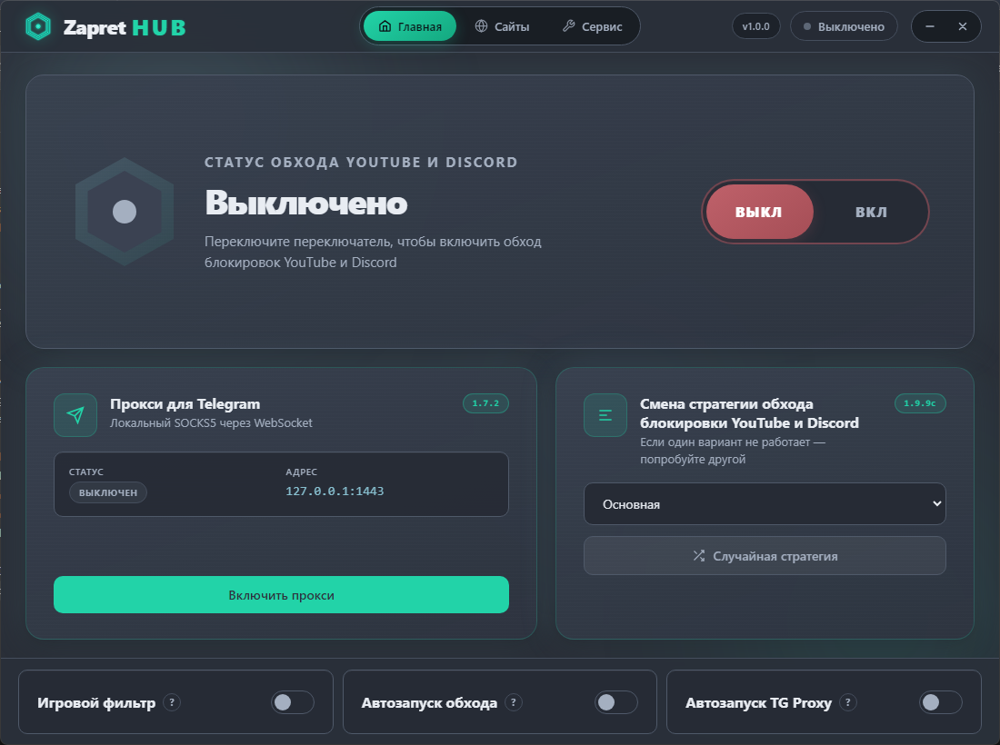
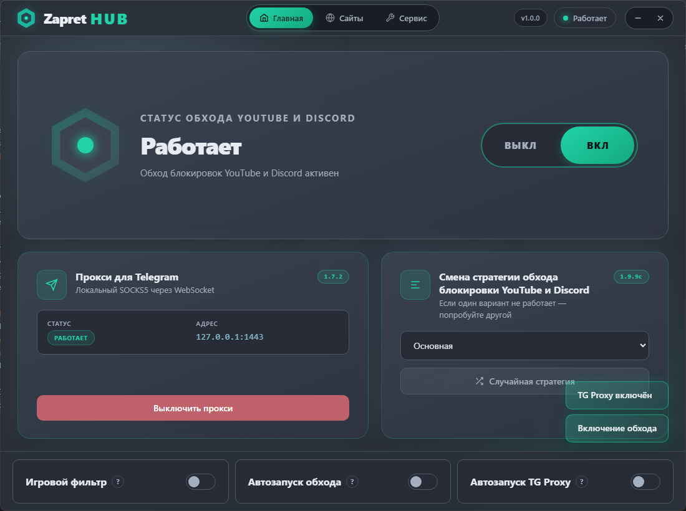
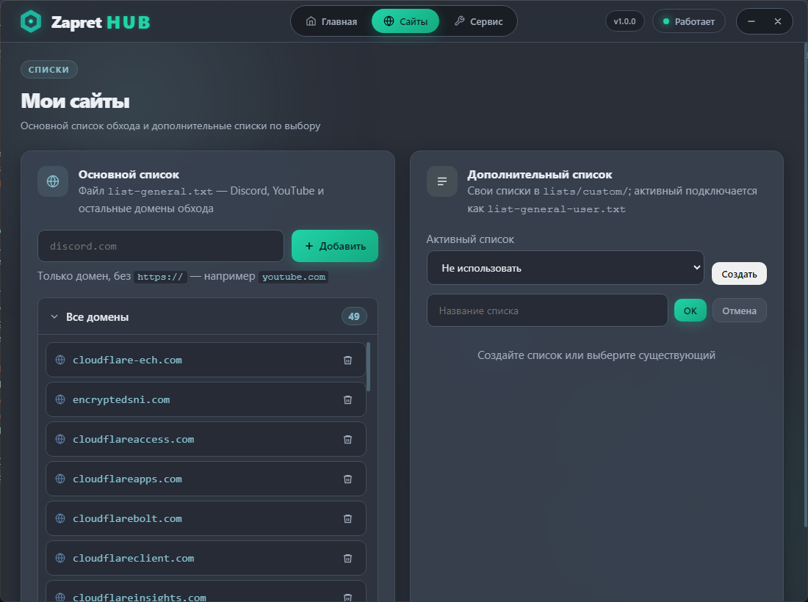
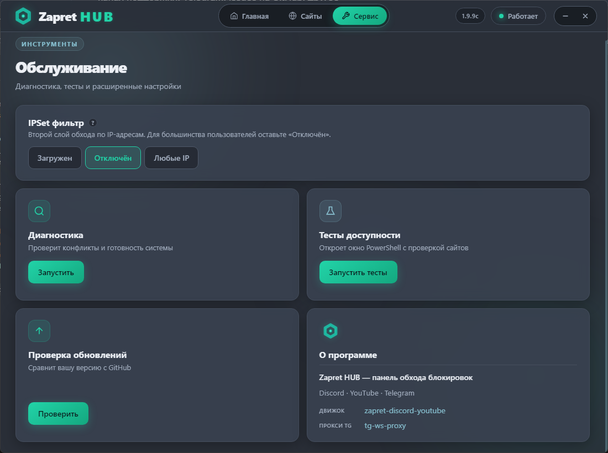

# Zapret HUB

**Графическая оболочка** для Windows — удобная панель управления обходом блокировок. Сама программа не реализует обход: она запускает и настраивает два открытых проекта из GitHub.

| Компонент | Репозиторий | Назначение |
|-----------|-------------|------------|
| Движок обхода | [Flowseal/zapret-discord-youtube](https://github.com/Flowseal/zapret-discord-youtube) | Discord, YouTube и другие сайты |
| Прокси Telegram | [Flowseal/tg-ws-proxy](https://github.com/Flowseal/tg-ws-proxy) | Локальный SOCKS5 для Telegram |

**Автор оболочки:** [xRAYNERx](https://github.com/xRAYNERx) · **Автор движков:** [Flowseal](https://github.com/Flowseal)

Zapret HUB не является официальным продуктом Flowseal. Подробнее о сторонних компонентах — [THIRD_PARTY_NOTICES.md](THIRD_PARTY_NOTICES.md).

---

Программа помогает открывать **Discord**, **YouTube** и **Telegram**, когда они не работают из‑за блокировок. Всё управляется из одного окна: включил — работает, выключил — всё как было.

## Скриншоты

| 1. Главный экран, выключено | 2. Главный экран, включено |
|:---:|:---:|
|  |  |

| 3. Вкладка «Сайты» | 4. Вкладка «Сервис» |
|:---:|:---:|
|  |  |

## Скачать

**[Releases](https://github.com/xRAYNERx/Zapret-HUB/releases)** — скачайте **ZapretHub-Setup-1.1.0.exe** (установщик).

При первом включении обхода Windows может спросить разрешение администратора — это нормально, подтвердите один раз.

> [!CAUTION]
>
> ### ⚠️ АНТИВИРУСЫ
> WinDivert (компонент движка обхода) может вызвать реакцию антивируса.
> WinDivert — инструмент для перехвата и фильтрации трафика, необходимый для работы zapret.
> Замена iptables и NFQUEUE в Linux, которых нет под Windows.
> Он может использоваться как хорошими, так и плохими программами, но **сам по себе не является вирусом**.
> Драйвер `WinDivert64.sys` подписан для возможности загрузки в 64-битное ядро Windows.
>
> *Выдержка из [readme](https://github.com/bol-van/zapret-win-bundle/blob/master/readme.md#%D0%B0%D0%BD%D1%82%D0%B8%D0%B2%D0%B8%D1%80%D1%83%D1%81%D1%8B) репозитория [bol-van/zapret-win-bundle](https://github.com/bol-van/zapret-win-bundle)*
>
> Некоторые антивирусы склонны относить файлы WinDivert к классам повышенного риска или хакерским инструментам. Происходит удаление файла и помещение его в карантин. При этом детект обязательно имеет название `WinDivert` или `Not-a-virus:RiskTool.Multi.WinDivert`.
>
> **Не пугайтесь** — это ожидаемая реакция на легитимный сетевой инструмент. В случае проблем с антивирусом добавьте **папку с движком zapret** (обычно `%APPDATA%\zapret-hub\engine`) в исключения, либо отключите детектирование PUA (потенциально нежелательных приложений). Например, в Касперском есть галочка «Обнаруживать легальные приложения, которые злоумышленники часто используют для нанесения вреда». При аккуратной и правильной настройке исключений рекомендуется настроить исключение; если вы не до конца понимаете, что делаете — рекомендуется отключить детект PUA.

## Что умеет

- Включать и выключать обход одним переключателем
- Прокси для Telegram — отдельно от обхода
- Автозапуск при включении компьютера — для Zapret и Telegram по отдельности
- **Автообновления** — при каждом запуске программа проверяет Zapret HUB, движок обхода и TG Proxy на GitHub и предлагает обновить
- **Подбор стратегии** — автоматическая проверка стратегий на вашем ПК с выбором лучшей
- Свои списки сайтов
- Работа из трея рядом с часами

## Требования

- Windows 10 или 11 (64-bit)