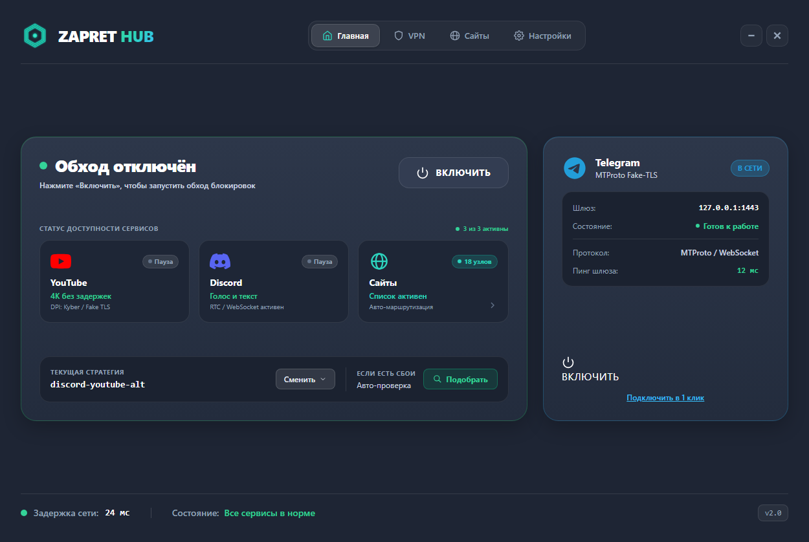
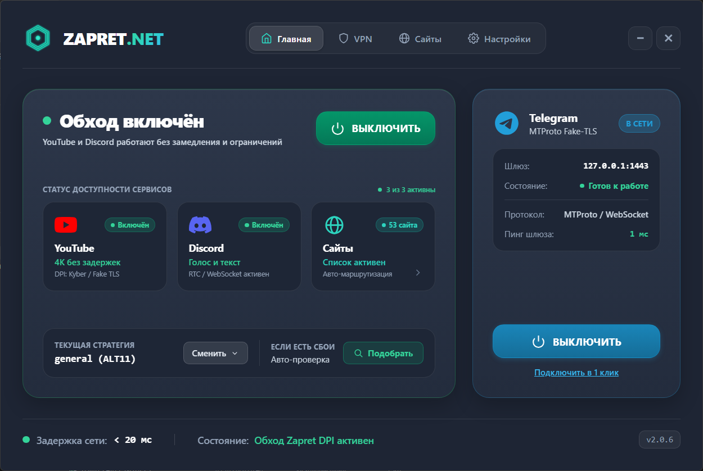
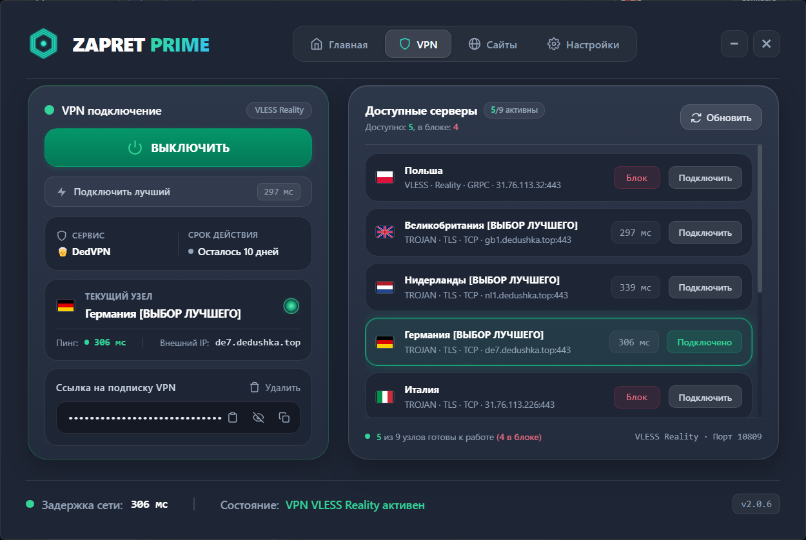
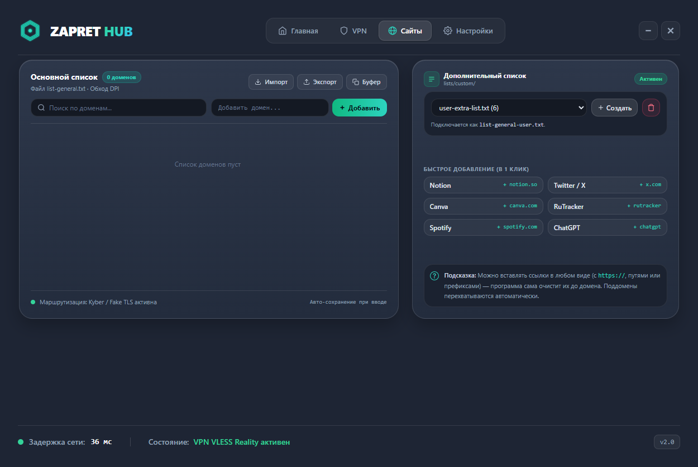
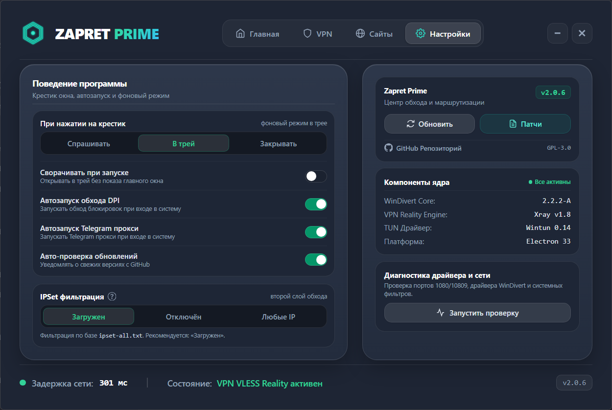

# Zapret HUB v2.0

**Графическая панель управления сетевым доступом для Windows.** Объединяет сразу три инструмента обхода ограничений в одном чистом, современном интерфейсе: локальный DPI-обход, встроенный прокси для Telegram и полноценный VPN на базе протокола VLESS Reality.

| Компонент | Технология / База | Назначение |
|---|---|---|
| **Движок DPI** | Собственный стек на базе [bol-van/zapret](https://github.com/bol-van/zapret) | Discord, YouTube и сайты без снижения скорости |
| **Прокси Telegram** | **ZapretTgProxy** (собственный шлюз) | Встроенный MTProto Fake-TLS шлюз для звонков и медиа |
| **VPN Reality** | [XTLS/Xray-core](https://github.com/XTLS/Xray-core) | VLESS Reality обход блокировок ТСПУ с авто-выбором ноды |

**Разработка и оболочка:** [xRAYNERx](https://github.com/xRAYNERx) · **Технологии:** bol-van (winws/WinDivert), Project X (Xray)

Zapret HUB является независимой панелью управления. Подробнее о сторонних компонентах — [THIRD_PARTY_NOTICES.md](THIRD_PARTY_NOTICES.md).

---

## Скриншоты интерфейса (Elevated Slate 2.0)

| 1. Главный экран (обход выключен) | 2. Главный экран (обход включён) |
|:---:|:---:|
|  |  |

| 3. Модуль VPN (VLESS Reality) | 4. Списки сайтов и доменов |
|:---:|:---:|
|  |  |

| 5. Настройки программы |
|:---:|
|  |

---

## Скачать

**[Перейти к релизам (GitHub Releases)](https://github.com/xRAYNERx/Zapret-HUB/releases/latest)** — скачайте **`ZapretHub-Setup-2.0.0.exe`** (установщик).

*При первом запуске сетевого драйвера Windows запросит права администратора — подтвердите один раз.*

---

## Основные возможности

### 🚀 Zapret DPI (YouTube & Discord)
* Включение и выключение обхода в один клик.
* **Авто-подбор стратегии** — встроенное экспресс-тестирование стратегий под вашего интернет-провайдера за 15 секунд с замером пинга и авто-выбором лучшей.
* Гибкая работа со списками сайтов (основной список, пользовательские списки, быстрый импорт популярных доменов).
* Режим IPSet-фильтрации для снижения нагрузки на систему.

### 🛡️ VPN (VLESS Reality)
* Встроенное ядро Xray с поддержкой протоколов **VLESS + Reality**.
* Поддержка ссылок на подписки и прямых `vless://` конфигураций.
* Автоматическая быстрая параллельная проверка пинга узлов (отсечение блокировок ТСПУ за считанные секунды).
* Кнопка **«Подключить лучший»** для мгновенного выбора сервера с наименьшей задержкой.
* Защита от конфликтов: автоматическое безопасное переключение сетевых драйверов между Zapret DPI и VPN.

### ✈️ Telegram Proxy
* Встроенный легковесный MTProto Fake-TLS прокси для ускорения загрузки фото, видео и аудиосообщений в Telegram.
* Подключение к Telegram в 1 клик через `tg://proxy`.
* Независимое управление и раздельный автозапуск.

### ⚙️ Удобство и интеграция с системой
* Полный редизайн интерфейса **Elevated Slate 2.0** с адаптивными карточками и индикаторами статуса.
* Сворачивание в трей при закрытии или запуске системы.
* Автоматическая проверка обновлений релизов на GitHub.
* Не требует установки сторонних утилит и зависимостей — всё необходимое упаковано внутри.

---

> [!CAUTION]
> ### ⚠️ Информация об антивирусах
> Компонент `WinDivert` (сетевой драйвер движка обхода zapret) может вызывать ложные срабатывания некоторых антивирусов.
> WinDivert — легитимный инструмент для перехвата и модификации сетевых пакетов в Windows (аналог iptables/NFQUEUE в Linux). Драйвер `WinDivert64.sys` подписан цифровой подписью.
> 
> Если антивирус блокирует драйвер (обычно с пометкой `RiskTool` или `Not-a-virus`), добавьте папку программы в исключения или разрешите выполнение сетевого драйвера.

---

## Системные требования
* **ОС:** Windows 10 / Windows 11 (только 64-bit)
* Права администратора (для разовой установки и работы сетевого драйвера WinDivert)